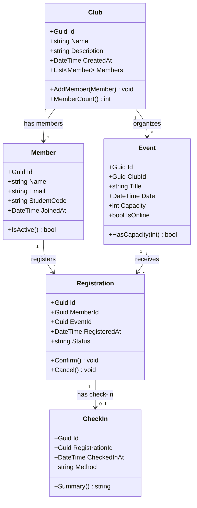


# EduHub - Class Diagram

## Domain Model

```mermaid
classDiagram
    class Member {
        +Guid Id
        +string Name
        +string Email
        +string StudentCode
        +DateTime JoinedAt
        +IsActive() bool
    }

    class Club {
        +Guid Id
        +string Name
        +string Description
        +DateTime CreatedAt
        +List~Member~ Members
        +AddMember(Member) void
        +MemberCount() int
    }

    class Event {
        +Guid Id
        +Guid ClubId
        +string Title
        +DateTime Date
        +int Capacity
        +bool IsOnline
        +HasCapacity(int) bool
    }

    class Registration {
        +Guid Id
        +Guid MemberId
        +Guid EventId
        +DateTime RegisteredAt
        +string Status
        +Confirm() void
        +Cancel() void
    }

    class CheckIn {
        +Guid Id
        +Guid RegistrationId
        +DateTime CheckedInAt
        +string Method
        +Summary() string
    }

    Club "1" --> "*" Member : has members
    Club "1" --> "*" Event : organizes
    Member "1" --> "*" Registration : registers
    Event "1" --> "*" Registration : receives
    Registration "1" --> "0..1" CheckIn : has check-in
```
